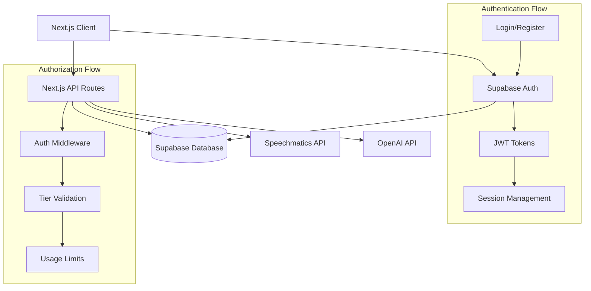

# Design Document

## Overview

This design document outlines the implementation of a comprehensive user authentication system for the Meeting Minutes App using Supabase Auth and Database. The system will transform the current open-access application into a secure, multi-tier platform with Free, Pro, and Admin user levels.

The authentication system leverages Supabase's built-in authentication services, PostgreSQL database, and real-time capabilities to provide secure user management, session handling, and usage tracking. This foundation will enable future admin panel functionality and subscription management.

## Architecture

### High-Level Architecture



### Technology Stack

- **Frontend**: Next.js 15.5.4 with React 19.1.0
- **Authentication**: Supabase Auth with JWT tokens
- **Database**: Supabase PostgreSQL
- **Session Management**: Supabase client-side session handling
- **API Protection**: Next.js middleware with Supabase JWT validation
- **Real-time**: Supabase real-time subscriptions for usage tracking

## Components and Interfaces

### 1. Authentication Components

#### AuthProvider Component
```typescript
interface AuthContextType {
  user: User | null;
  userProfile: UserProfile | null;
  loading: boolean;
  signIn: (email: string, password: string) => Promise<AuthResponse>;
  signUp: (email: string, password: string) => Promise<AuthResponse>;
  signOut: () => Promise<void>;
  updateProfile: (updates: Partial<UserProfile>) => Promise<void>;
}
```

#### Login/Register Forms
- Email/password input validation
- Error handling and display
- Loading states and feedback
- Redirect handling after authentication

#### Protected Route Wrapper
```typescript
interface ProtectedRouteProps {
  children: React.ReactNode;
  requiredTier?: 'free' | 'pro' | 'admin';
  fallback?: React.ReactNode;
}
```

### 2. Database Schema

#### User Profiles Table
```sql
CREATE TABLE user_profiles (
  id UUID REFERENCES auth.users(id) PRIMARY KEY,
  email TEXT NOT NULL,
  tier TEXT NOT NULL DEFAULT 'free' CHECK (tier IN ('free', 'pro', 'admin')),
  created_at TIMESTAMP WITH TIME ZONE DEFAULT NOW(),
  updated_at TIMESTAMP WITH TIME ZONE DEFAULT NOW(),
  usage_reset_date TIMESTAMP WITH TIME ZONE DEFAULT NOW(),
  metadata JSONB DEFAULT '{}'::jsonb
);
```

#### Transcription Jobs Table
```sql
CREATE TABLE transcription_jobs (
  id UUID DEFAULT gen_random_uuid() PRIMARY KEY,
  user_id UUID REFERENCES user_profiles(id) NOT NULL,
  job_id TEXT, -- Speechmatics job ID
  filename TEXT NOT NULL,
  file_size BIGINT,
  duration_seconds INTEGER,
  status TEXT NOT NULL DEFAULT 'processing',
  tier TEXT NOT NULL,
  created_at TIMESTAMP WITH TIME ZONE DEFAULT NOW(),
  completed_at TIMESTAMP WITH TIME ZONE,
  error_message TEXT,
  usage_cost INTEGER DEFAULT 1 -- Usage units consumed
);
```

#### Usage Limits Table
```sql
CREATE TABLE tier_limits (
  tier TEXT PRIMARY KEY CHECK (tier IN ('free', 'pro', 'admin')),
  monthly_transcription_limit INTEGER NOT NULL,
  max_file_size_mb INTEGER NOT NULL,
  max_duration_minutes INTEGER NOT NULL,
  features JSONB DEFAULT '{}'::jsonb
);
```

#### User Sessions Table (Optional - for analytics)
```sql
CREATE TABLE user_sessions (
  id UUID DEFAULT gen_random_uuid() PRIMARY KEY,
  user_id UUID REFERENCES user_profiles(id) NOT NULL,
  login_at TIMESTAMP WITH TIME ZONE DEFAULT NOW(),
  ip_address INET,
  user_agent TEXT,
  tier TEXT NOT NULL
);
```

### 3. API Middleware

#### Authentication Middleware
```typescript
interface AuthenticatedRequest extends NextRequest {
  user: {
    id: string;
    email: string;
    tier: 'free' | 'pro' | 'admin';
  };
}

interface MiddlewareConfig {
  requireAuth?: boolean;
  requiredTier?: 'free' | 'pro' | 'admin';
  checkUsageLimits?: boolean;
}
```

#### Usage Tracking Service
```typescript
interface UsageService {
  checkLimits(userId: string, tier: string): Promise<UsageLimitResult>;
  recordUsage(userId: string, jobData: TranscriptionJobData): Promise<void>;
  getCurrentUsage(userId: string): Promise<UsageStats>;
  resetMonthlyUsage(userId: string): Promise<void>;
}
```

### 4. Tier Management

#### Tier Configuration
```typescript
interface TierConfig {
  free: {
    monthlyLimit: 10; // transcriptions per month
    maxFileSizeMB: 25;
    maxDurationMinutes: 30;
    features: ['basic_transcription'];
  };
  pro: {
    monthlyLimit: 100;
    maxFileSizeMB: 100;
    maxDurationMinutes: 120;
    features: ['basic_transcription', 'speaker_diarization', 'summaries', 'translations'];
  };
  admin: {
    monthlyLimit: -1; // unlimited
    maxFileSizeMB: -1; // unlimited
    maxDurationMinutes: -1; // unlimited
    features: ['all_features', 'admin_dashboard', 'user_management'];
  };
}
```

## Data Models

### User Profile Model
```typescript
interface UserProfile {
  id: string;
  email: string;
  tier: 'free' | 'pro' | 'admin';
  createdAt: string;
  updatedAt: string;
  usageResetDate: string;
  metadata: {
    firstName?: string;
    lastName?: string;
    company?: string;
    preferences?: Record<string, any>;
  };
}
```

### Transcription Job Model
```typescript
interface TranscriptionJob {
  id: string;
  userId: string;
  jobId?: string; // Speechmatics job ID
  filename: string;
  fileSize: number;
  durationSeconds?: number;
  status: 'processing' | 'completed' | 'failed';
  tier: string;
  createdAt: string;
  completedAt?: string;
  errorMessage?: string;
  usageCost: number;
}
```

### Usage Stats Model
```typescript
interface UsageStats {
  currentMonth: {
    transcriptionsUsed: number;
    transcriptionsLimit: number;
    totalDurationMinutes: number;
    totalFileSizeMB: number;
  };
  tier: string;
  resetDate: string;
  isLimitExceeded: boolean;
}
```

## Error Handling

### Authentication Errors
- Invalid credentials → Clear error message with retry option
- Unverified email → Verification prompt with resend option
- Session expired → Automatic refresh attempt, then redirect to login
- Network errors → Retry mechanism with exponential backoff

### Authorization Errors
- Insufficient tier → Upgrade prompt with tier comparison
- Usage limit exceeded → Clear limit information with upgrade option
- Feature not available → Tier-specific feature explanation

### API Error Responses
```typescript
interface APIError {
  error: string;
  code: 'AUTH_REQUIRED' | 'INSUFFICIENT_TIER' | 'USAGE_LIMIT_EXCEEDED' | 'INVALID_REQUEST';
  details?: {
    currentTier?: string;
    requiredTier?: string;
    usageStats?: UsageStats;
    upgradeUrl?: string;
  };
}
```

## Testing Strategy

### Unit Tests
- Authentication service functions
- Usage calculation logic
- Tier validation functions
- Database query functions

### Integration Tests
- Supabase Auth integration
- API route authentication
- Database operations
- Usage limit enforcement

### End-to-End Tests
- Complete registration flow
- Login and session management
- Protected route access
- Tier-based feature access
- Usage limit scenarios

### Test Data Management
- Separate test Supabase project
- Automated test user creation/cleanup
- Mock external API responses (Speechmatics, OpenAI)
- Usage limit simulation

## Security Considerations

### Authentication Security
- JWT token validation on all protected routes
- Secure session management with Supabase
- Password strength requirements enforced by Supabase
- Email verification required for account activation

### Authorization Security
- Row Level Security (RLS) policies in Supabase
- Tier-based access control validation
- API rate limiting per user/tier
- Input validation and sanitization

### Data Protection
- Encrypted data transmission (HTTPS)
- Secure storage of user data in Supabase
- Audit logging for sensitive operations
- GDPR compliance for user data handling

### RLS Policies Examples
```sql
-- Users can only access their own profile
CREATE POLICY "Users can view own profile" ON user_profiles
  FOR SELECT USING (auth.uid() = id);

-- Users can only access their own transcription jobs
CREATE POLICY "Users can view own jobs" ON transcription_jobs
  FOR SELECT USING (auth.uid() = user_id);

-- Admins can access all data
CREATE POLICY "Admins can view all profiles" ON user_profiles
  FOR ALL USING (
    EXISTS (
      SELECT 1 FROM user_profiles 
      WHERE id = auth.uid() AND tier = 'admin'
    )
  );
```

## Performance Considerations

### Database Optimization
- Indexes on frequently queried columns (user_id, created_at, tier)
- Efficient usage calculation queries
- Connection pooling with Supabase
- Query optimization for analytics

### Caching Strategy
- Client-side user profile caching
- Usage stats caching with TTL
- Tier configuration caching
- Session state management

### Real-time Features
- Supabase real-time subscriptions for usage updates
- Live usage meter for users approaching limits
- Real-time job status updates
- Admin dashboard real-time metrics

## Migration Strategy

### Phase 1: Core Authentication
1. Set up Supabase project and configuration
2. Implement basic auth components and flows
3. Add authentication middleware to API routes
4. Migrate existing routes to require authentication

### Phase 2: User Profiles and Tiers
1. Create database schema and RLS policies
2. Implement user profile management
3. Add tier-based access control
4. Update UI to show tier-specific features

### Phase 3: Usage Tracking
1. Implement usage tracking in transcription API
2. Add usage limit enforcement
3. Create usage dashboard for users
4. Implement monthly usage reset logic

### Phase 4: Admin Features
1. Create admin dashboard components
2. Implement user management features
3. Add system monitoring and analytics
4. Deploy tier upgrade/downgrade functionality